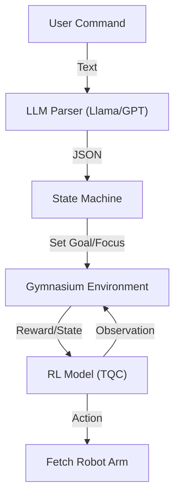

# 🤖 LLM-Driven Fetch Robot Controller

This project implements a **natural language interface** for controlling a Fetch robotic arm in a simulated environment (`gymnasium-robotics`). It uses a Large Language Model (LLM) to parse user intent into precise spatial commands and a pre-trained Reinforcement Learning (RL) agent (`TQC` from `Stable-Baselines3`) to execute the movement dynamics.

## Videos

Stacking blocks (short):

https://github.com/user-attachments/assets/30333f68-7b79-4e04-ae1f-95e83ccc1749


Overall : 

https://github.com/user-attachments/assets/4f00a40a-98d4-4b68-9d3b-923aa208510c


## 🌟 Key Features

* **Natural Language Control:** Speak to the robot naturally (e.g., *"Put the blue block on the right edge"*).
* **Hybrid Intelligence:**
* **Brain (LLM):** Parses semantic intent, spatial logic, and sequence planning.
* **Body (RL Agent):** Handles the physics-based motor control to reach targets.


* **Smart Coordinate System:** Supports both **relative** commands ("above red") and **absolute** table coordinates ("x=1.3").
* **Auto-Stabilization:** Includes logic to park the arm rigidly after movement to prevent RL jitter.
* **Hugging Face Integration:** Automatically downloads model weights from the cloud if missing locally.

---

## 🏗️ Architecture

The system operates in a loop:

1. **User Input:** Text command via console.
2. **LLM Parser:** Uses function calling (OpenAI/Groq schema) to extract intents (`goal`, `focus`, `sequence`).
3. **State Machine:** Updates the environment state (e.g., active object ID, target coordinates).
4. **RL Inference:** The TQC agent predicts motor actions to reach the target.
5. **Stabilizer:** Hard-stops the motors once the goal is reached.



---

## ⚙️ Installation

### 1. Prerequisites

* Python 3.10+
* [MuJoCo](https://mujoco.org/) (usually included with newer gymnasium-robotics)

### 2. Install Dependencies

```bash
pip install gymnasium gymnasium-robotics stable-baselines3 sb3-contrib openai numpy python-dotenv huggingface_hub

```

### 3. Clone & Setup

```bash
git clone https://github.com/your-username/fetch-llm-controller.git
cd fetch-llm-controller

```

---

## 🚀 Configuration

1. **Environment Variables:**
Create a `.env` file in the root directory:
```ini
# Choose your provider
GROK_API=gsk_... 
# OR
OPENAI_API_KEY=sk-...

HF_TOKEN=hf_...

```


2. **Model Weights:**
The script is configured to download weights automatically from Hugging Face.
* If you want to train your own, save them as `models/tqcdense_model.zip`.


---

## 🎮 Usage

Run the main controller script:

```bash
python main.py

```

### Supported Commands

| Intent | Example Command | Description |
| --- | --- | --- |
| **Goal (Absolute)** | *"Move blue to the right edge"* | Moves object to specific table coordinates. |
| **Goal (Relative)** | *"Put green above the blue block"* | Stacks or places objects relative to others. |
| **Sequence** | *"Stack blue on red"* | Executes a multi-step pick-and-place operation. |
| **Control** | *"Start" / "Stop"* | Manually starts or freezes the physics engine. |
| **Environment** | *"Reset with 2 objects"* | Resets the simulation with a specific object count(Min=1, Max=5 objects). |

### Coordinate System

The parser maps natural language to the Fetch table coordinates (in meters):

* **X (Depth):** `1.15` (Back) to `1.45` (Front)
* **Y (Width):** `0.60` (Right) to `1.00` (Left)
* **Z (Height):** `0.425` (Table Surface)

---

## 📂 Project Structure

* **`main.py`**: The entry point. Handles the user input loop, integrates the LLM, and manages the RL agent execution loop.
* **`wrappers.py`**: Custom Gym wrappers:
* `ActiveObjectWrapper`: Tricks the RL agent into seeing only the selected object.
* `ManualGoalWrapper`: Allows manual overriding of the goal (e.g., "Set goal to [x,y,z]").


* **`my_envs/`**: Custom environment definitions (if extending standard Fetch tasks).
* **`models/`**: Stores local `.zip` and `.pkl` model files.
* **`upload_to_hf.py`**: Utility script to push your trained models to Hugging Face Spaces/Hub.

---

## 🧠 specific Logic Details

### The "Vibration" Fix

RL models often jitter when holding a position because they are constantly correcting errors. We solved this by implementing a **Finite Action Loop**:

1. The agent runs for exactly ~3 seconds (80 frames) to reach the target.
2. The script sends a `[0,0,0]` velocity command to "park" the arm.
3. The physics loop pauses (`state['running'] = False`) until the next command.

### The "Auto-Focus"

The standard Fetch environment expects the agent to know *which* object to move.

* **Problem:** User says "Move Green", but the robot is looking at "Black".
* **Solution:** The script intercepts the command, finds the ID for "Green", and forces `env.set_active_object(id)` before executing the move.

---

## 🤝 Contributing

1. Fork the repository.
2. Create a feature branch (`git checkout -b feature/NewTask`).
3. Commit your changes.
4. Push to the branch and open a Pull Request.

## 📄 License

[MIT License](https://www.google.com/search?q=LICENSE)
